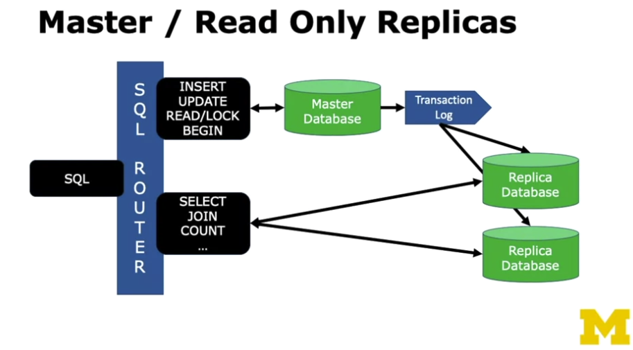
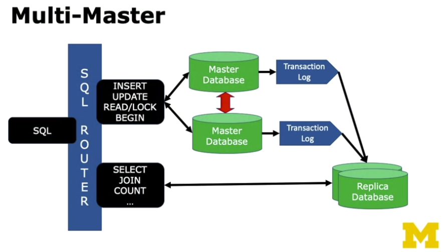
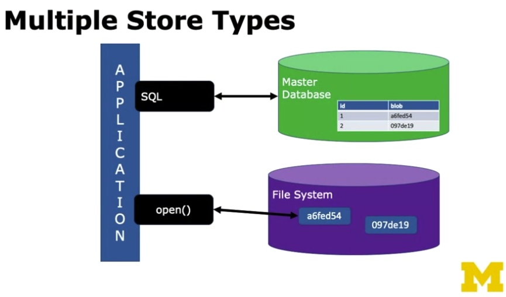
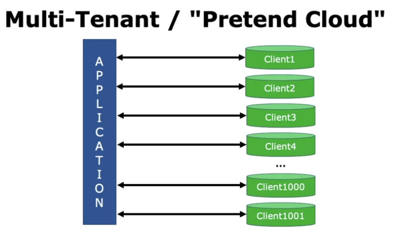

# Scaling Relational Databases

It is difficult to scale ACID, so we need to combine ACID and BASE inorder to scale.THere are many ways to scale database, here are some examples.

**Method 1: Vertical Scalling**

- It's just throwing more hardware at the problem. More drives, more spinning disks, more channels, more external ports. But there's a limit, and it was really difficult to virtualise large memory and many processors  
  

**Method 2: Master/Read only Replicas**

- It have one master database. And that's a traditional vertically scaled database. We make it as fast as we can. And we're going to take transactions that either are going to require statements that require a transaction or are going to change the database, and we route that to the master database server. And then as changes are made, it spews out a transaction log. Transaction logs are how databases ensure that changes are made. They write it to the transaction log, then they write it to the actual database. And if something blows up in the middle they go back and look the transaction log and they reapply. That's what transaction logs are for. But you can have a number of other servers that are watching those transaction logs, and then having a replica of the database and every time they see a transaction, then they add it to the replica. And so this actually is kind of BASE-like eventual consistency.
- But the idea of read-only replicas released the need to completely scale the master database for the reads.

  

**Method 3: Multi-Master**

- you have two master databases but because the master database has the responsibility of sort of putting a block on all transactions on the way until the transaction in flight really completes, there's a lot of coordination between the masters.
- it's not a really good solution because of so much coordination between the masters.

  

**Method 4: Multi Store Types**

- Things like profile pictures in a blogging system or an uploaded picture can store in shared filed system, as those are mostly read only thing.
- it's nice to have an independent backup between your relational system and your file system just because especially if you're storing your files based on some kind of a hash. The backup is really beautifully simple for a file system and the backup is a little harder for an ACID-style relational database.
  

**Method 5: Multi Store Types**

- There's also what I'll call a multi-tenant pretend cloud. I'm a cloud vendor, but I really don't have a cloud application. And so what they have is one bunch of application code. And then they have little tiny single-instance relational databases, one for each client. And then they say overall, we've got like 1,000 clients, but you also have like 1,000 databases.

